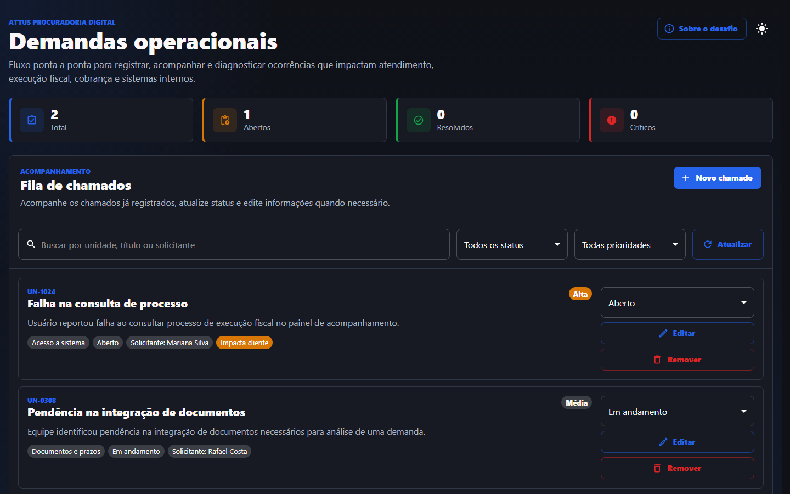

# Attus Fullstack Challenge

Projeto full stack para gerenciamento de demandas operacionais de procuradoria digital, criado para demonstrar uma funcionalidade ponta a ponta com front-end, back-end, banco de dados, logs, testes e documentação técnica.

O domínio escolhido foi um módulo de ocorrências internas, com foco em problemas que podem impactar atendimento, execução fiscal, cobrança, análise de documentos e sistemas internos.

## Preview



## O que este projeto entrega

- Criação e edição de chamados operacionais.
- Listagem de chamados com busca, filtros por status e prioridade.
- Alteração de status diretamente no acompanhamento.
- Remoção de chamados.
- Indicadores resumidos por total, abertos, resolvidos e críticos.
- Tema claro/escuro com Material UI e preferência salva no navegador.
- Validações no front-end e no back-end.
- API REST documentada com Swagger/OpenAPI.
- Persistência em MariaDB com migrações Flyway.
- Logs mínimos para diagnóstico com `X-Request-Id`.
- Testes automatizados no front-end e no back-end.
- Análise de incidente em documento separado.

## Como avaliar rapidamente

1. Suba o projeto com Docker Compose.
2. Acesse o front-end e crie um novo chamado.
3. Tente salvar com campos obrigatórios vazios para ver validação, borda vermelha, toast de erro e foco no primeiro campo inválido.
4. Edite um chamado existente e confirme que a tela abre preenchida.
5. Altere o status pelo acompanhamento e observe o toast de sucesso.
6. Troque um chamado para `Cancelado` ou remova um chamado para validar os modais de confirmação.
7. Use busca e filtros para validar a listagem.
8. Acesse o Swagger para conferir os endpoints da API.
9. Consulte os logs do back-end para verificar o `X-Request-Id`.

## Stack

- Front-end: React, TypeScript, Vite, Material UI, MUI Icons, SCSS e Vitest.
- Back-end: Java 21, Spring Boot, Spring Web, Spring Data JPA, Bean Validation.
- Banco de dados: MariaDB.
- Documentação da API: Swagger/OpenAPI.
- Migrações: Flyway.
- Testes: Vitest no front-end, JUnit, Mockito e MockMvc no back-end.
- Execução local: Docker Compose.

## Como executar com Docker

Na raiz do projeto:

```bash
docker compose up --build
```

Serviços:

- Front-end: http://localhost:5173
- API: http://localhost:8080
- Swagger: http://localhost:8080/swagger-ui.html
- MariaDB: localhost:3307

Credenciais locais do banco:

```text
database: attus_challenge
user: attus
password: attus
root password: root
```

## Como executar sem Docker Compose

Suba apenas o banco:

```bash
docker compose up -d db
```

Back-end:

```bash
cd backend
mvn spring-boot:run
```

Front-end:

```bash
cd frontend
npm install
npm run dev
```

Observação: se não houver Maven instalado localmente, use o comando de testes com Docker descrito abaixo.

## Testes

Back-end, usando Maven via Docker:

```bash
docker run --rm -v "${PWD}/backend:/app" -w /app maven:3.9.9-eclipse-temurin-21 mvn test
```

Front-end:

```bash
cd frontend
npm install
npm test
```

Build do front-end:

```bash
cd frontend
npm run build
```

## Endpoints da API

Base URL local:

```text
http://localhost:8080/api
```

### Pesquisar/listar chamados

```http
GET /tickets
```

O mesmo endpoint retorna todos os chamados quando não há query params e aplica busca/filtros quando eles são enviados:

```text
status=OPEN | IN_PROGRESS | RESOLVED | CANCELED
priority=LOW | MEDIUM | HIGH | CRITICAL
search=texto
```

### Buscar chamado por ID

```http
GET /tickets/{id}
```

### Criar chamado

```http
POST /tickets
Content-Type: application/json
```

Exemplo:

```json
{
  "title": "Falha na consulta de processo",
  "storeCode": "UN-1024",
  "requesterName": "Mariana Silva",
  "category": "SYSTEM_ACCESS",
  "priority": "HIGH",
  "description": "Usuário reportou falha ao consultar processo de execução fiscal no painel de acompanhamento.",
  "customerImpact": true
}
```

No contrato da API, `storeCode` representa o código da unidade interna relacionada à demanda.

### Atualizar chamado

```http
PUT /tickets/{id}
Content-Type: application/json
```

Usa o mesmo corpo do `POST`.

### Atualizar status

```http
PATCH /tickets/{id}/status
Content-Type: application/json
```

```json
{
  "status": "RESOLVED"
}
```

### Remover chamado

```http
DELETE /tickets/{id}
```

### Indicadores

```http
GET /tickets/stats
```

## Checklist do desafio

| Requisito | Entrega |
| --- | --- |
| Funcionalidade ponta a ponta | Fluxo completo de criação, edição, listagem, filtros, status e remoção |
| Front-end funcional | React com TypeScript, Material UI, telas separadas, validações, toast e modais de confirmação |
| Back-end | API REST com Spring Boot e arquitetura em camadas |
| Persistência | MariaDB com Flyway |
| Logs mínimos | `X-Request-Id`, logs de criação, edição, status, remoção e erros |
| API documentada | Swagger/OpenAPI disponível em `/swagger-ui.html` |
| Testes | Testes de front-end e back-end cobrindo cenários principais |
| Análise de incidente | Documento `INCIDENT_ANALYSIS.md` |
| Nota técnica | Documento `TECHNICAL_NOTES.md` |

## Estrutura do projeto

```text
attus-fullstack-challenge/
  backend/
    src/main/java/.../challenge/
    src/main/resources/db/migration/
    src/test/java/.../challenge/
  frontend/
    src/
      App/
      api/
      components/
      styles/
      theme/
      types/
      utils/
  docs/
    preview-dashboard.png
  docker-compose.yml
  TECHNICAL_NOTES.md
  INCIDENT_ANALYSIS.md
```

## Documentos complementares

- `frontend/README.md`: detalhes de execução, stack e estrutura do front-end.
- `backend/README.md`: detalhes de execução, variáveis, arquitetura e endpoints do back-end.
- `TECHNICAL_NOTES.md`: decisões técnicas, trade-offs e melhorias futuras.
- `INCIDENT_ANALYSIS.md`: análise de incidente com logs, hipóteses, correção e medidas preventivas.
